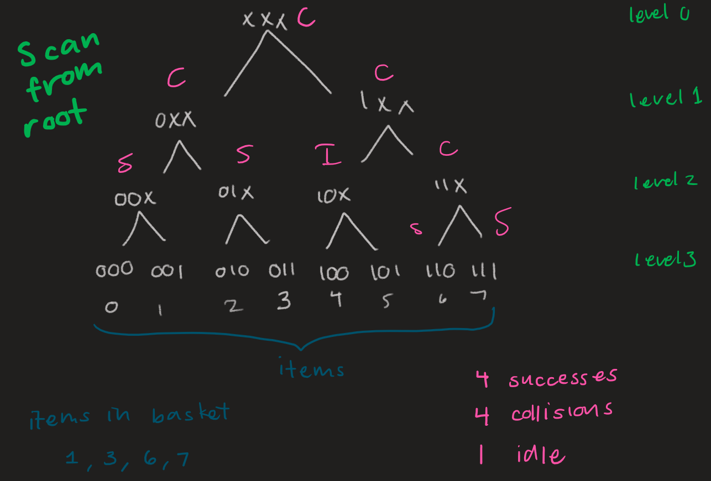

# mac-protocols

## compiling and running program

Check out user manual for instructions how to run program  

## notes

* items are represented by an integer, but when being scanned is represented in binary where number of bits is K
* customer text files represent items in basket
* at nodes... collision is when more than 1 item fits  the node description, idle is when no nodes fit description, and success is when an item is successfully scanned (bit match)
* below is a simple example of how scanning from the root works for K=3, when items in basket are: 1, 3, 5, 7
 
* for scannning at the leaf each leaf node is checked one at a time starting at 0 to see if there is an item in basket with matching bit
